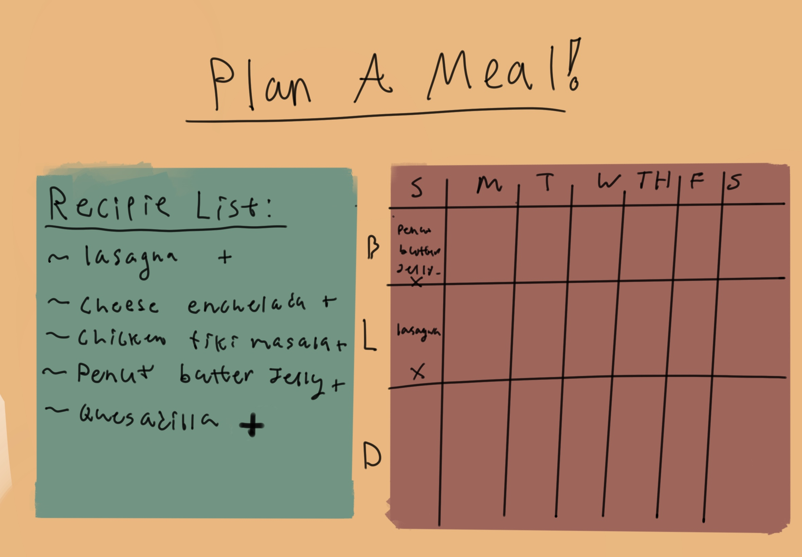

# PROJECT PROPOSAL:
--------------
### List of team members: 
- Wolfgang Loudenburg
- Ari Guzzi

### Overall description of the project:
- The topic/purpose of the SPA:
    The purpose of our site is to build a meal planner that can be populated with recipease from a json file we create. The planner will be helpful for people to plan out three meals a day over over a selected amount of time.

- Your inspiration for the SPA:
   The inspiration for our meal planner is our capstone project in whcih we are creating an app/website to assist backpackers & campers with food prep. All trails, REI website, and patagoina are all UI insperations for our project.

- The intended audience for your SPA:
    Anyone looking for a helpful way to organize their meal planning.

### Wireframe that shows the design and flow of your team's project. This could be anywhere from hand drawn sequence of images to a low-fidelity mockup in a UX design tool of choice:

### Any content or information sources you intend to draw upon, start thinking about them early and include them in the proposal if possible:
We will create our own recipies that exist within a JSON file.

### Describe what you anticipate your personal contributions to the team and the project will be in the end:
Wolfgang: Focus on reading JSON to populate list and building form to add to JSON.
Ari: Will focus on the graph/table elements of the SPA and how to populate items into graph through user input.

### Your goals for the project should be split up by what you think are goals for:
- Prototyping/proof of concept:
Read info from a json to populate a list, and have a way to add items into tabular data
- MVP (Minimum Viable Product):
Select amount of days needed for planning and seperate days into breakfast, lunch, and dinner to be populated with recipies from JSON
- Stretch goals:
Have a form for users to add their own recipies to the list

# Ari's Process Blog: 
- https://docs.google.com/document/d/1Y0o8XWJIQI0Nw_X_wjixvSl7_ARjcLaoS2fpsf6ah1s/edit?usp=sharing
# Wolfgang's Process Blog: 
- https://docs.google.com/document/d/1q_tPiTyGbD3ds5BwM6QjXFoTGuPKH57STme_ZwQ1C1g/edit?usp=sharing
- # Wolfgang's Reflection:
- https://docs.google.com/document/d/1TIXeSBQ4w2XdK_mxiBRuez245brnHAvn5B3TightA2I/edit?usp=sharing
